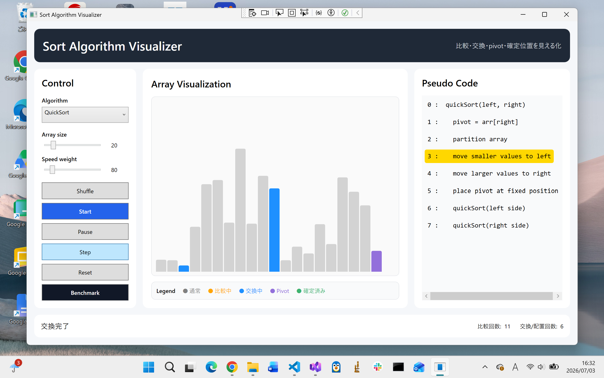
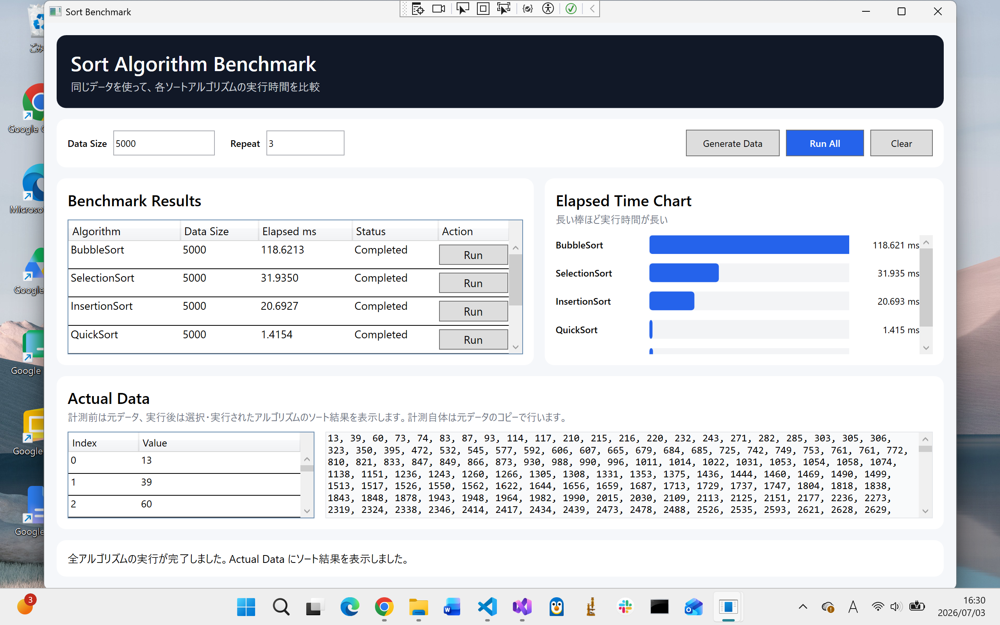

# SortVisualizer

**C# / WPF で作成した、ソートアルゴリズムの可視化・実行時間比較アプリです。**

配列がどのように並び替えられていくのかを、棒グラフ・色分け・擬似コードで直感的に理解できる学習用アプリです。

<table>
  <tr>
    <td align="center">
      <br>
      <sub>Main window</sub>
    </td>
    <td align="center">
      <br>
      <sub>Benchmark window</sub>
    </td>
  </tr>
</table>

---

## 📌 概要

`SortVisualizer` は、ソートアルゴリズムの処理過程を1ステップずつ可視化するアプリです。

通常のソート処理では、最終的な並び替え結果しか見えません。  
しかし、このアプリでは以下のような処理の途中状態を確認できます。

- どの要素を比較しているか
- どの要素を交換しているか
- pivot がどこにあるか
- どこまでソート済みか
- 擬似コードのどの行を実行しているか

そのため、単にコードを読むだけよりも、アルゴリズムの動きを理解しやすくなっています。

---

## ✨ 主な機能

### 🧠 アルゴリズム可視化

- ソート処理の自動再生
- 1ステップずつ進める Step 実行
- 一時停止
- リセット
- 配列サイズの変更
- 実行速度の調整
- 棒グラフによる配列の可視化
- 擬似コードの現在行ハイライト
- 比較回数の表示
- 交換 / 配置回数の表示

### 📊 ベンチマーク

- 各アルゴリズムの実行時間を測定
- 各アルゴリズムの個別実行
- 全アルゴリズムの一括実行
- 実行時間の表形式表示
- 実行時間の棒グラフ表示
- 実際に使用したデータの表示
- ソート後データの表示

---

## 🧮 実装済みアルゴリズム

| アルゴリズム | 特徴 |
|---|---|
| Bubble Sort | 隣同士を比較して交換する基本的なソート |
| Selection Sort | 未整列範囲から最小値を探して前に置くソート |
| Insertion Sort | 整列済み領域に要素を挿入していくソート |
| Quick Sort | pivot を基準に左右へ分割する高速なソート |
| Merge Sort | 分割してから結合する安定したソート |

---

## 🖥️ 画面構成

### 🧭 MainWindow

ソートアルゴリズムの動きを可視化するメイン画面です。

| 領域 | 内容 |
|---|---|
| 左側 | アルゴリズム選択・配列サイズ・速度・操作ボタン |
| 中央 | 配列の棒グラフ表示 |
| 右側 | 擬似コード表示 |
| 下部 | 現在の処理内容・比較回数・交換回数 |

---

### 📈 BenchmarkWindow

各ソートアルゴリズムの実行時間を比較する画面です。

| 機能 | 内容 |
|---|---|
| Data Size | 使用する配列サイズを指定 |
| Repeat | 測定の繰り返し回数を指定 |
| Run | 選択したアルゴリズムだけ実行 |
| Run All | 全アルゴリズムを一括実行 |
| Result Table | 実行時間を表で表示 |
| Bar Chart | 実行時間を棒グラフで表示 |
| Actual Data | 実際に使用した配列データを表示 |

---

## 🎨 色の意味

| 色 | 意味 |
|---|---|
| ⚪ グレー | 通常状態 |
| 🟠 オレンジ | 比較中 |
| 🔵 青 | 交換中 / 配置中 |
| 🟣 紫 | pivot |
| 🟢 緑 | 確定済み |

---

## 🛠️ 使用技術

- C#
- WPF
- .NET 8
- ObservableCollection
- INotifyPropertyChanged
- Stopwatch
- MVVM風の構成

---

## 📁 プロジェクト構成

```text
SortVisualizer/
├─ SortVisualizer.csproj
├─ App.xaml
├─ App.xaml.cs
├─ MainWindow.xaml
├─ MainWindow.xaml.cs
├─ BenchmarkWindow.xaml
├─ BenchmarkWindow.xaml.cs
├─ Models/
│  ├─ BarItem.cs
│  ├─ BenchmarkResult.cs
│  ├─ CodeLineItem.cs
│  ├─ DataValueItem.cs
│  ├─ SortAlgorithmType.cs
│  └─ SortStep.cs
├─ Services/
│  ├─ SortBenchmarkService.cs
│  └─ SortStepGenerator.cs
└─ ViewModels/
   └─ MainViewModel.cs
```

---

## ▶️ 実行方法

1. Visual Studio でプロジェクトを開く
2. `SortVisualizer` をスタートアッププロジェクトに設定する
3. `F5` または「開始」ボタンで実行する

---

## 🧩 設計メモ

このアプリでは、可視化用とベンチマーク用で処理を分けています。

### 👀 可視化用

可視化では、ソート結果だけでなく、処理の途中経過が必要です。  
そのため、`SortStep` というクラスを使って、1ステップごとの状態を保存しています。

`SortStep` には以下の情報を持たせています。

- 現在の配列
- 比較中のインデックス
- 交換中のインデックス
- pivot のインデックス
- 確定済みのインデックス
- 表示メッセージ
- 擬似コードの現在行

これにより、UI側では `SortStep` を順番に表示するだけで、ソート処理を再生できます。

---

### ⏱️ ベンチマーク用

ベンチマークでは、可視化処理を使わず、純粋なソート処理だけを測定します。

可視化用の処理を使ってしまうと、

- UI更新
- 配列コピー
- `SortStep` の生成
- 色分け処理

などの時間が混ざってしまいます。

そのため、実行時間比較では `SortBenchmarkService` を使って、純粋なソート時間だけを測定しています。

---

## 🚧 今後追加したい機能

- Heap Sort
- Shell Sort
- Counting Sort
- Radix Sort
- Array.Sort との比較
- データパターン選択
  - Random
  - Sorted
  - Reverse
  - Nearly Sorted
  - Few Unique Values
- CSV出力
- ベンチマーク結果の保存
- より詳細な統計情報の表示
- グラフ表示の強化
- ソート中の配列範囲表示

---

## 📚 学習ポイント

このアプリを作ることで、以下を学習できます。

- WPF の基本構造
- XAML によるUI設計
- DataBinding
- ObservableCollection
- INotifyPropertyChanged
- 非同期処理
- CancellationToken
- Stopwatch による時間計測
- ソートアルゴリズムの実装
- アルゴリズム可視化の設計

---

## 📝 ライセンス

未設定

---

## 🙌 Note

このアプリは、ソートアルゴリズムを「結果」ではなく「過程」で理解することを目的としています。

コードの動きと画面上の変化を対応させることで、アルゴリズムの考え方を視覚的に学べます。
